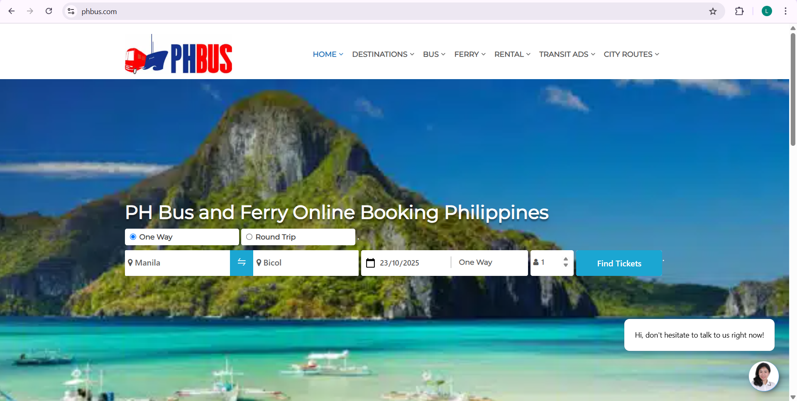
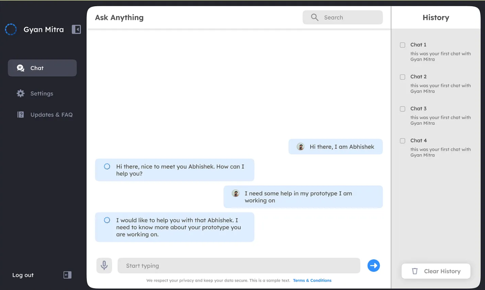

#  **Bus Seat Reservation System with AI Chatbot**


<br>
<br>

## 📘**Project Description**


The Bus Seat Reservation System with AI Chatbot is a web-based platform designed to streamline the process of booking bus seats through intelligent automation. The system integrates a helpdesk chatbot that assists users in navigating the reservation process, providing information about bus schedules, seat availability, and fare details in real time.

The integration of the chatbot also allows for automated customer support, minimizing human workload and providing instant responses to inquiries. Overall, this system seeks to demonstrate how AI-driven assistance can improve transportation management, customer satisfaction, and booking accuracy within public transit services.

<br>

## 🎨**Features**

- **AI Chatbot Assistant** – Helps users inquire and book bus seats through conversation.  
- **Seat Visualization System** – Displays seat availability using color indicators (e.g., green = available, red = reserved).  
- **Booking Management** – Allows users to confirm, cancel, and modify seat reservations.  
- **Automated Inquiry Handling** – Provides instant responses to frequently asked questions.  
- **Admin Dashboard** – Enables admins to manage buses, schedules, and booking records.  
- **Comparative Evaluation Module** – Collects and compares user data between chatbot-assisted and manual booking.

<br>

## 🖼️**Screenshot**
 



<br>

## ⚙️**Installation Steps**

```bash
# 1. Clone the repository
git clone https://github.com/lorasoterio/bus-seat-reservation-chatbot.git

# 2. Navigate to the project directory
cd bus-seat-reservation-chatbot

# 3. Install Pipenv if you haven’t yet
pip install pipenv

# 4. Create a new virtual environment and install dependencies
pipenv install

# 5. Activate the virtual environment
pipenv shell

# 6. Configure environment variables
DB_NAME=dbname
DB_USER=postgres
DB_PASSWORD=password
DB_HOST=localhost
DB_PORT=port
DIALOGFLOW_PROJECT_ID=project_id

# 7.Run database migrations
python manage.py migrate

# 8. Start the backend server
python manage.py runserver


```

<br>

## 🧩**Technologies Used**
| Layer              | Tools / Frameworks                          |
| :----------------- | :------------------------------------------ |
| **Frontend**       | HTML, CSS, JavaScript, React.js             |
| **Backend**        | Python (Django)                             |
| **Database**       | PostgreSQL                                  |
| **AI Integration** | Dialogflow |

<br>

## 👩‍💻**Contributors**
- Lora Soterio
- Mikyla Dasco
- Jecel Baitan
- Vea Santillan
- Mark Lawrence Pedir
- Vougn Jeric Jardinero

